# Infrastructure & Automation (Terraform, Ansible, Traefik, GitHub Actions)

## Objectif
L'objectif de ce projet est d'automatiser un cycle complet d'infrastructure et de déploiement sur un environnement hybride local:
- 1 controller/runner Linux (GitHub Actions self-hosted + Ansible controller en conteneur),
- 1 target Linux,
- 1 target Windows (pilotée via WinRM),
- 1 load balancer Traefik pour exposer les services applicatifs.

Le rendu couvre uniquement ce périmètre: orchestration CI/CD, génération dynamique d'inventaire, automatisation Ansible multi-OS, mise en place du routage Traefik et validation fonctionnelle.

## Vue d’ensemble de l’architecture
Flux global:
1. Le workflow GitHub Actions déclenche les jobs `runner-proof`, `terraform-inventory`, puis `ansible-automation`.
2. Terraform produit la metadata des targets.
3. Les templates Jinja2 rendent:
   - l'inventaire Ansible,
   - la configuration dynamique Traefik.
4. Ansible exécute:
   - facts controller/Linux/Windows,
   - changement de timezone Linux + Windows,
   - déploiement TP1 sur Linux et Windows.
5. Traefik route les accès par hostname (`app.runner.local`, `api.runner.local`, etc.) vers les backends.

Références ciblées:
- [main.tf](/g:/Projet/Efrei/M1/DevOps/DevOps/TP2/terraform/main.tf)
- [inventory.yml.j2](/g:/Projet/Efrei/M1/DevOps/DevOps/TP2/templates/inventory.yml.j2)
- [tp2-automation.yml](/g:/Projet/Efrei/M1/DevOps/DevOps/.github/workflows/tp2-automation.yml)

Preuve plateforme de virtualisation:

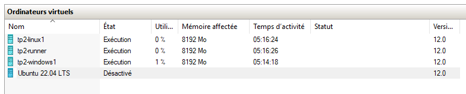

## CI/CD (GitHub Actions self-hosted)
Le pipeline est exécuté sur runner self-hosted Linux avec enchaînement:
- `runner-proof`: preuve d'exécution sur runner local.
- `terraform-inventory`: Terraform + génération des fichiers dynamiques.
- `ansible-automation`: déploiement et validations.

Référence:
- [tp2-automation.yml](/g:/Projet/Efrei/M1/DevOps/DevOps/.github/workflows/tp2-automation.yml)

Preuve runner self-hosted enregistré:

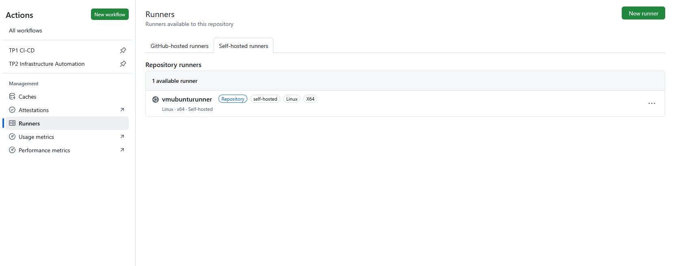

Preuve exécution sur runner local:

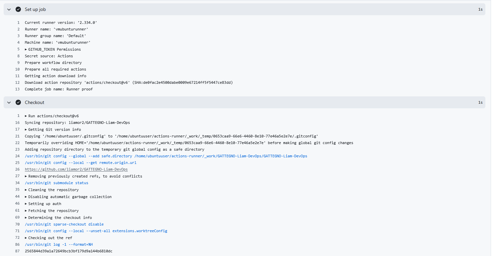

Preuve pipeline complète:

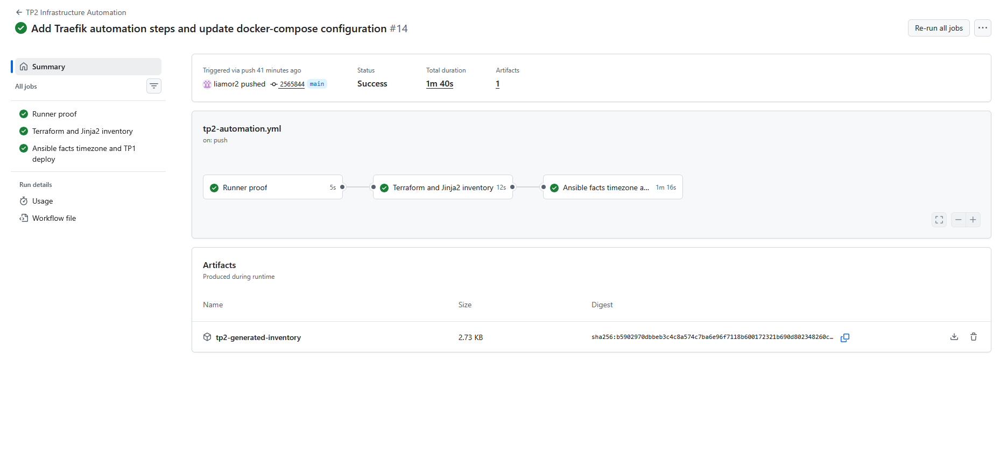

Preuve logs pipeline:

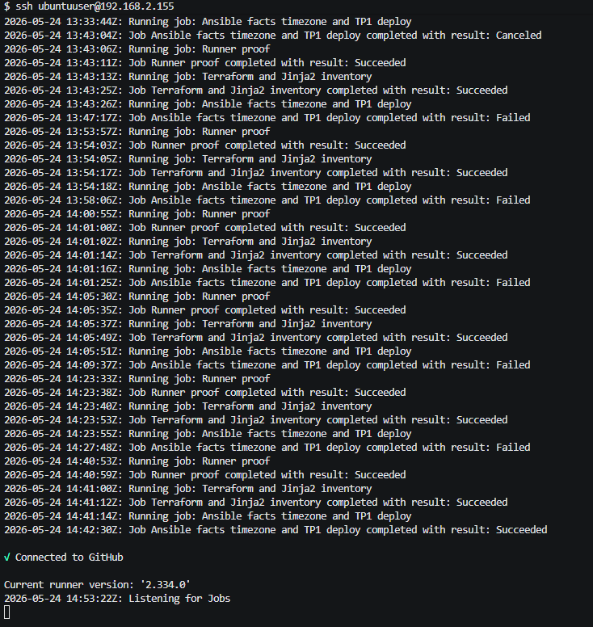

Preuve job Terraform:

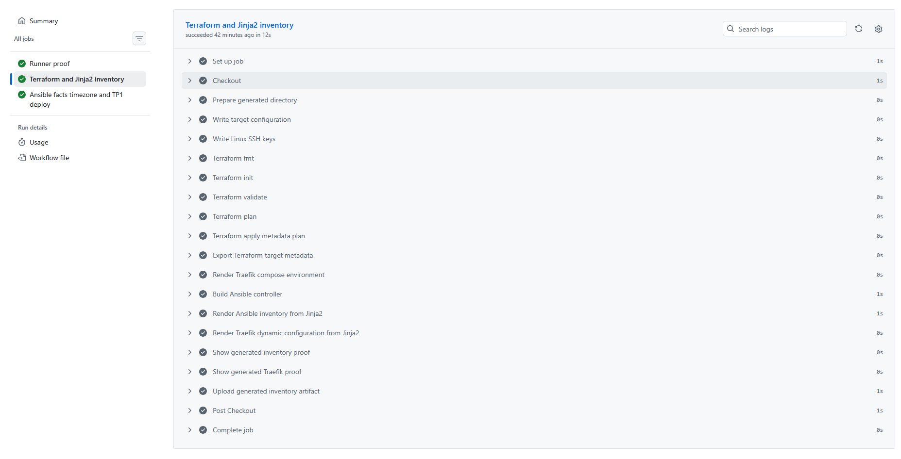

Preuve job Ansible:

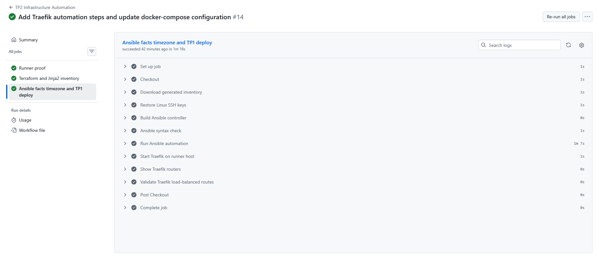

## Terraform + Jinja2 (génération dynamique)
La partie IaC produit les cibles et le contexte d'automatisation, puis rend des fichiers consommés par Ansible et Traefik.

Composants clés:
- Définition/transformations Terraform des targets et du load balancer.
- Rendu Jinja2 via script Python.
- Artefacts générés: `targets.json`, `inventory.yml`, `generated/traefik/dynamic.yml`.

### Ajout d’un serveur (scalabilité)
L'ajout d'un nouveau serveur ne nécessite pas de modifier les playbooks:
1. Ajouter la cible dans le secret GitHub de configuration des targets.
2. Ajouter le secret d'authentification associé (clé SSH Linux ou mot de passe Windows) avec un `auth_ref` cohérent.
3. Relancer la pipeline: l'inventaire et la configuration Traefik sont régénérés automatiquement.

Cette approche permet d'étendre l'infrastructure en restant piloté par la configuration CI/CD.

Références ciblées:
- [main.tf](/g:/Projet/Efrei/M1/DevOps/DevOps/TP2/terraform/main.tf)
- [render_inventory.py](/g:/Projet/Efrei/M1/DevOps/DevOps/TP2/scripts/render_inventory.py)
- [traefik-dynamic.yml.j2](/g:/Projet/Efrei/M1/DevOps/DevOps/TP2/templates/traefik-dynamic.yml.j2)

Preuve variables targets:

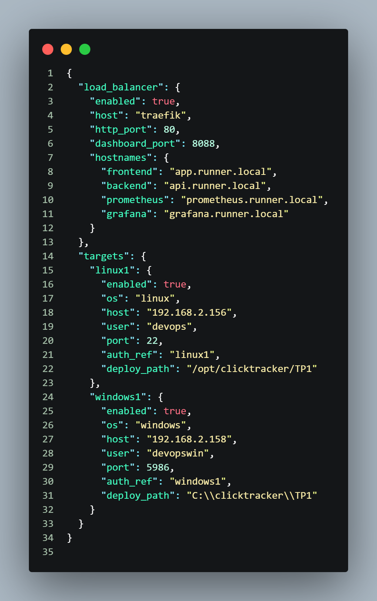

Preuve metadata targets générée:

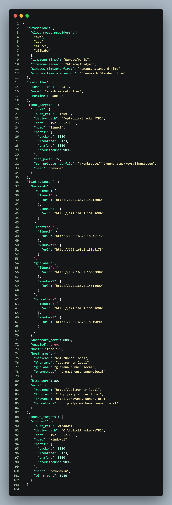

Preuve inventaire Ansible généré:

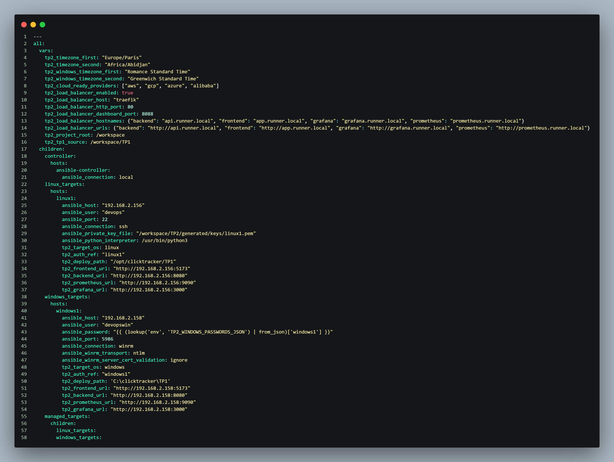

Preuve configuration dynamique Traefik générée:

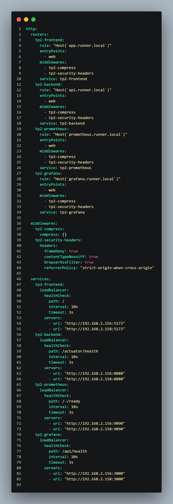

## Ansible (facts, timezone, déploiement multi-OS)
La séquence Ansible couvre:
- collecte des facts sur controller, Linux et Windows,
- gestion de timezone Linux (`Europe/Paris` puis `Africa/Abidjan`),
- gestion de timezone Windows (équivalent Windows des fuseaux demandés),
- déploiement de TP1 sur Linux et Windows.

Références ciblées:
- [facts.yml](/g:/Projet/Efrei/M1/DevOps/DevOps/TP2/ansible/playbooks/facts.yml)
- [timezone.yml](/g:/Projet/Efrei/M1/DevOps/DevOps/TP2/ansible/playbooks/timezone.yml)
- [deploy_tp1.yml](/g:/Projet/Efrei/M1/DevOps/DevOps/TP2/ansible/playbooks/deploy_tp1.yml)

Preuve timezone/facts:

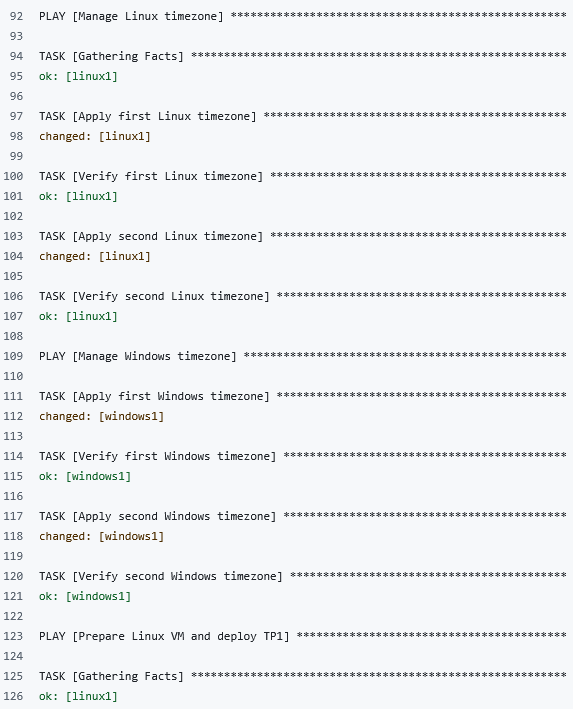

Preuve déploiement Linux:

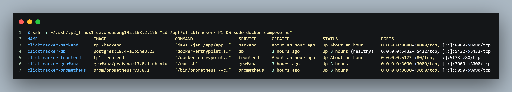

Preuve déploiement Windows:

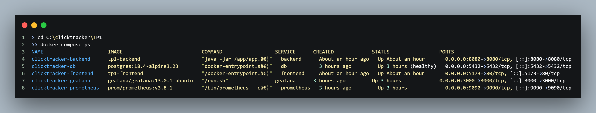

## Traefik (load balancing & routage)
Traefik est utilisé comme point d'entrée HTTP unique, avec routage par hostnames:
- `app.runner.local` -> frontend,
- `api.runner.local` -> backend,
- `prometheus.runner.local` -> Prometheus,
- `grafana.runner.local` -> Grafana.

Le dashboard et l'API Traefik permettent de valider que routers/services sont bien chargés.

Références ciblées:
- [docker-compose.yml](/g:/Projet/Efrei/M1/DevOps/DevOps/TP2/docker-compose.yml)
- [traefik.yml](/g:/Projet/Efrei/M1/DevOps/DevOps/TP2/ansible/playbooks/traefik.yml)
- [traefik-dynamic.yml.j2](/g:/Projet/Efrei/M1/DevOps/DevOps/TP2/templates/traefik-dynamic.yml.j2)

Preuve dashboard Traefik:

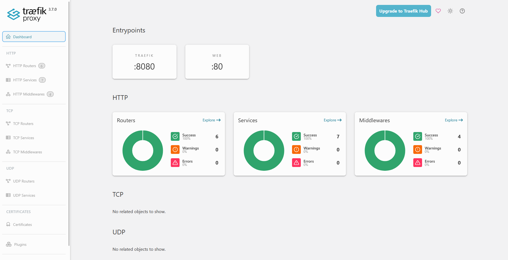

Preuve routers Traefik:

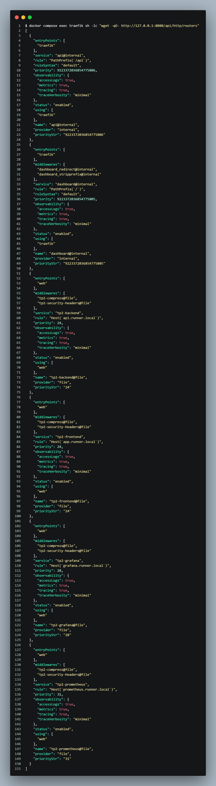

Preuve services Traefik:

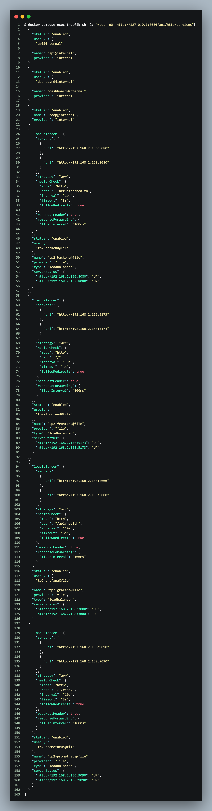

Preuve load balancing via Traefik:

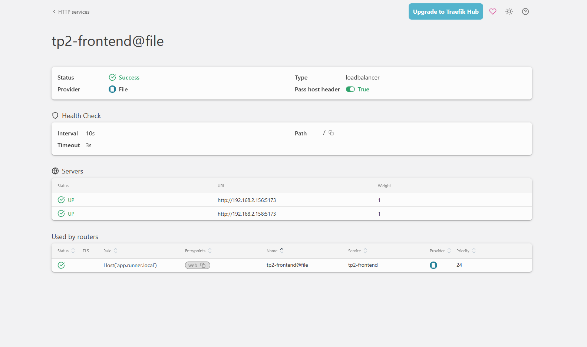

Preuve application accessible via hostname Traefik:

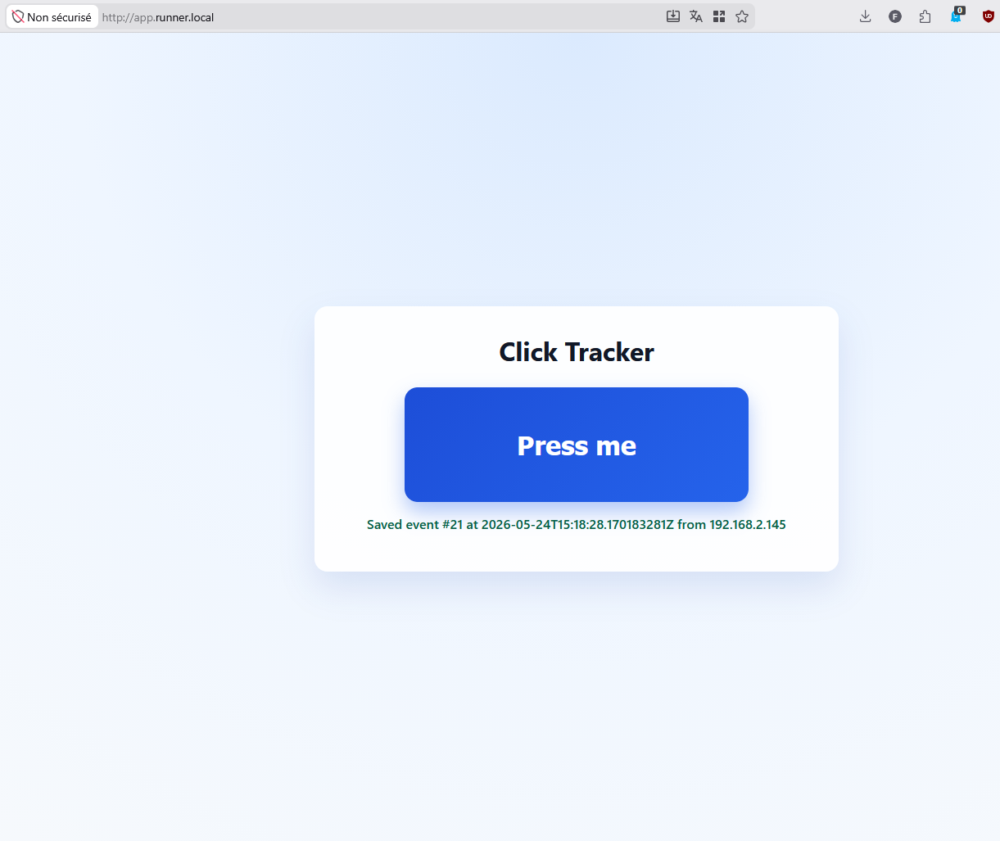

## Validation fonctionnelle (endpoints et preuves d’exécution)
Les validations couvrent:
- endpoints directs sur Linux et Windows,
- endpoints via Traefik avec `Host` header,
- disponibilité des composants frontend/backend/prometheus/grafana.

Preuve endpoints fonctionnels:

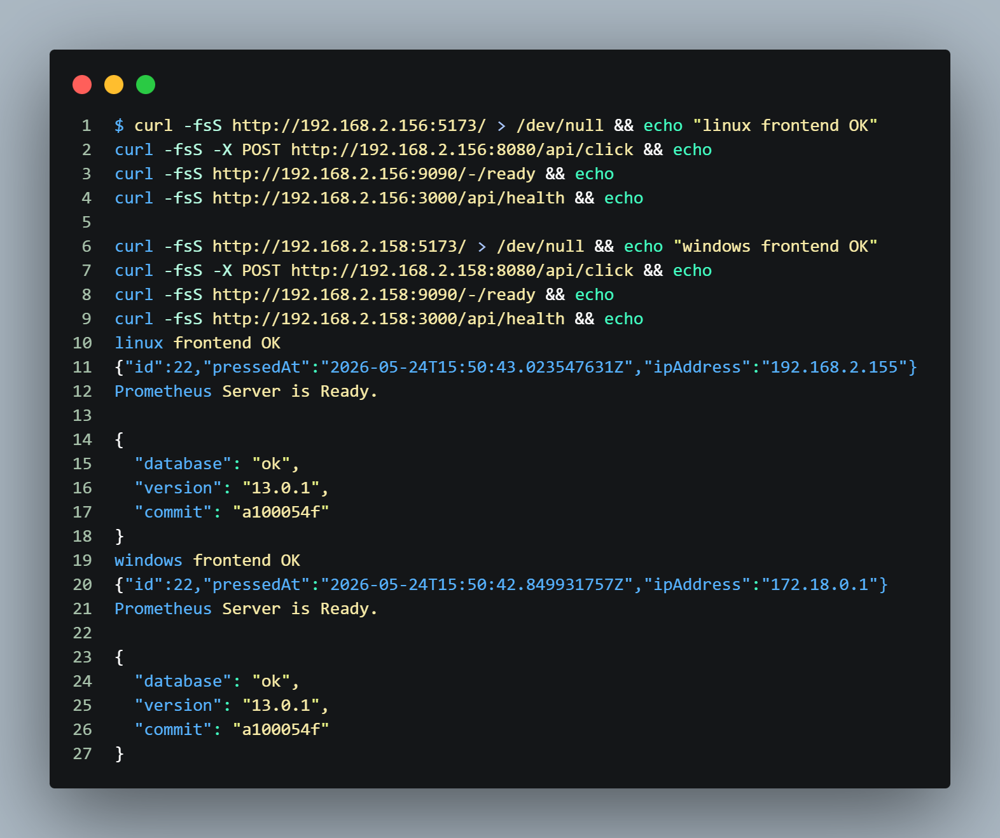

Commandes clés de vérification :

```bash
# Endpoints directs Linux
curl -fsS http://<LINUX_TARGET_IP>:5173/ > /dev/null
curl -fsS -X POST http://<LINUX_TARGET_IP>:8080/api/click
curl -fsS http://<LINUX_TARGET_IP>:9090/-/ready
curl -fsS http://<LINUX_TARGET_IP>:3000/api/health

# Endpoints directs Windows
curl -fsS http://<WINDOWS_TARGET_IP>:5173/ > /dev/null
curl -fsS -X POST http://<WINDOWS_TARGET_IP>:8080/api/click
curl -fsS http://<WINDOWS_TARGET_IP>:9090/-/ready
curl -fsS http://<WINDOWS_TARGET_IP>:3000/api/health

# Endpoints via Traefik (Host header)
curl -fsS -H "Host: app.runner.local" http://<RUNNER_IP>:80/
curl -fsS -X POST -H "Host: api.runner.local" http://<RUNNER_IP>:80/api/click
curl -fsS -H "Host: prometheus.runner.local" http://<RUNNER_IP>:80/-/ready
curl -fsS -H "Host: grafana.runner.local" http://<RUNNER_IP>:80/api/health

# Vérification routers Traefik
docker compose -f TP2/docker-compose.yml exec -T traefik sh -lc "wget -qO- http://127.0.0.1:8080/api/http/routers"

# Vérification état des conteneurs sur targets
ssh -i ~/.ssh/tp2_linux1 <linux_user>@<LINUX_TARGET_IP> "cd /opt/clicktracker/TP1 && docker compose ps"
# Sur la VM Windows:
# cd C:\clicktracker\TP1
# docker compose ps
```

## Incidents rencontrés et correctifs appliqués
### 1) Authentification WinRM et accès distant Windows
- Symptôme: erreurs d'accès/refus lors des tests WinRM (`Accès refusé`, listeners non exploitables).
- Correction: configuration WinRM HTTPS, vérification des listeners, ajustement des droits utilisateur admin local.

### 2) Docker en session WinRM (Windows)
- Symptôme: `docker compose` échouait en session WinRM alors qu'il fonctionnait en session interactive locale.
- Correction: exécution du déploiement Windows via tâche planifiée locale déclenchée par Ansible.
- Référence: [deploy_tp1.yml](/g:/Projet/Efrei/M1/DevOps/DevOps/TP2/ansible/playbooks/deploy_tp1.yml)

### 3) Chargement configuration dynamique Traefik
- Symptôme: Traefik renvoyait `404` alors que les backends étaient opérationnels.
- Cause: montage/état de `dynamic.yml` incorrect (`is a directory`), empêchant le provider file de charger les routers.
- Correction: stabilisation du montage et de la séquence de rendu/recréation, validation explicite des routers via API Traefik.
- Références:
  - [docker-compose.yml](/g:/Projet/Efrei/M1/DevOps/DevOps/TP2/docker-compose.yml)
  - [traefik.yml](/g:/Projet/Efrei/M1/DevOps/DevOps/TP2/ansible/playbooks/traefik.yml)

## Conclusion technique
Le périmètre du projet couvre:
- pipeline CI/CD exécutée sur runner self-hosted,
- génération dynamique Terraform/Jinja2,
- automatisation Ansible multi-OS (Linux + Windows),
- déploiement applicatif sur les deux targets,
- routage Traefik opérationnel et vérifié par preuves.